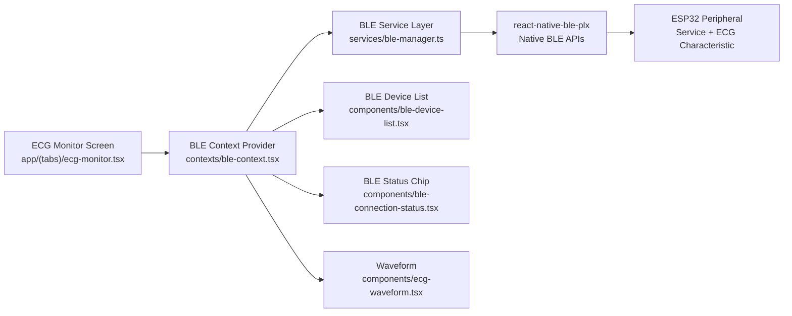
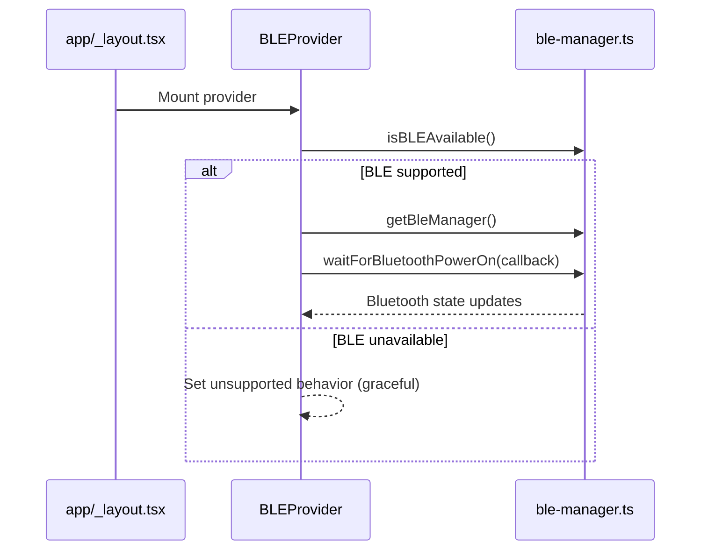
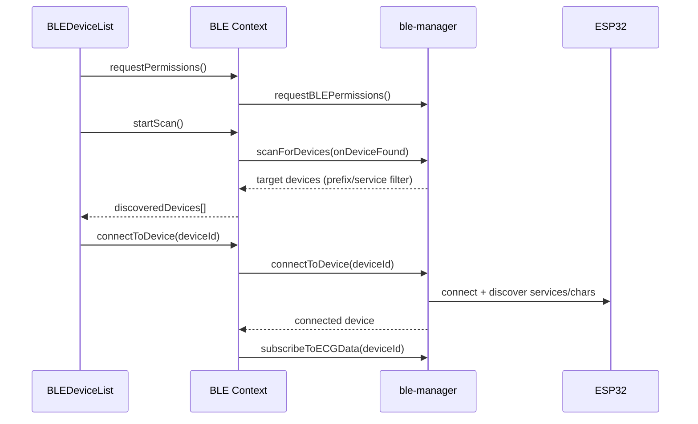
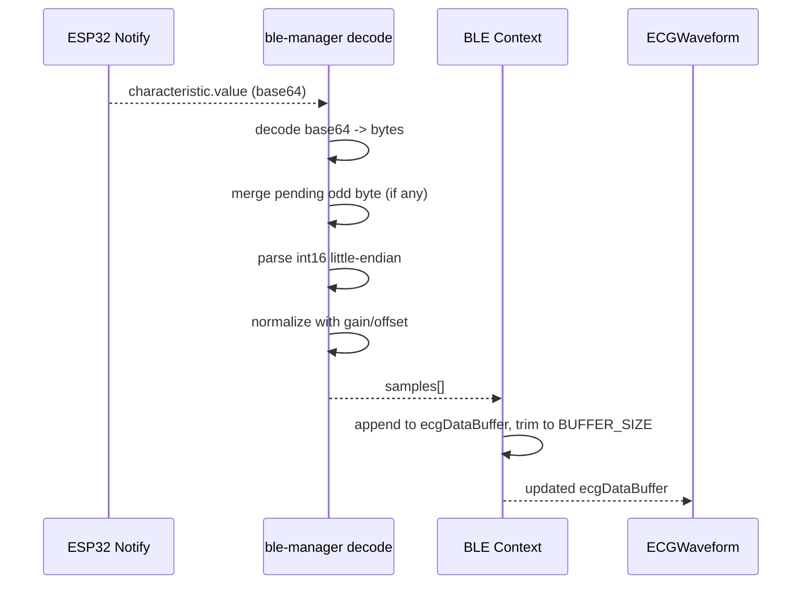

# Sowa BLE Architecture (ESP32 ECG)

## 1) Purpose

This document explains the **current production BLE architecture** in the Sowa app for connecting to an ESP32 ECG peripheral and rendering live waveform data.

It is written for:

- Mobile engineers maintaining the React Native app
- Firmware engineers building ESP32 BLE payloads
- QA engineers validating connection and stream quality

If you need the strict firmware-side contract, also read:

- `docs/ESP32_BLE_CONTRACT.md`

---

## 2) High-Level Architecture



### Design goals

- Keep BLE complexity in one service (`ble-manager.ts`)
- Keep app-wide state in one provider (`ble-context.tsx`)
- Keep screens/components thin and declarative
- Work safely in unsupported environments (Expo Go/web) without crashes
- Handle packet boundary issues in ECG stream decoding

---

## 3) Runtime Composition

### App root wiring

- `app/_layout.tsx` wraps the app with `BLEProvider`.
- This makes BLE state and actions globally available via hooks.

### Primary BLE screen

- `app/(tabs)/ecg-monitor.tsx` is the main consumer.
- It uses:
  - `useBLE()` for connection actions/state
  - `useECGStream()` for waveform sample data

### Core layers

- `constants/ble-constants.ts`
  - UUIDs, timeouts, buffering, sample normalization config, error types
- `services/ble-manager.ts`
  - Native BLE operations + payload decoding + error mapping
- `contexts/ble-context.tsx`
  - State machine and lifecycle orchestration
- `hooks/use-ble.ts`
  - Convenience re-exports for BLE hooks

---

## 4) File Responsibilities (Detailed)

## `constants/ble-constants.ts`

Central BLE configuration:

- Device identification
  - `DEVICE_NAME_PREFIX`
- Discovery/connection
  - `SCAN_TIMEOUT_MS`, `SCAN_OPTIONS.allowDuplicates`
  - `CONNECTION_TIMEOUT_MS`, `AUTO_RECONNECT`, `RECONNECT_ATTEMPTS`, `RECONNECT_DELAY_MS`
- ECG streaming
  - `SAMPLE_RATE`, `BUFFER_SIZE`, `SAMPLE_GAIN`, `SAMPLE_OFFSET`
- Typed error taxonomy
  - `BLEErrorType`

## `services/ble-manager.ts`

Low-level BLE adapter using `react-native-ble-plx`:

- Lazy module load and manager creation
- Runtime permission handling (iOS/Android differences)
- Bluetooth power-state monitoring
- Device scanning with filter + dedupe
- Connect/disconnect operations
- Characteristic monitor subscription with transaction cancellation
- ECG decode pipeline:
  - base64 -> bytes -> int16 little-endian -> normalized number
- Error normalization into app-friendly `BLEError`

## `contexts/ble-context.tsx`

App-level BLE state machine:

- Maintains current BLE status and discovered devices
- Starts/stops scans
- Connects/disconnects devices
- Manages ECG stream subscription lifecycle
- Implements bounded buffer (`ecgDataBuffer`)
- Implements reconnect attempts with delay

## UI components

- `components/ble-device-list.tsx`
  - Scan modal, connect/disconnect actions, status/error banners
- `components/ble-connection-status.tsx`
  - Compact animated status indicator for header usage
- `components/ecg-waveform.tsx`
  - Renders live ECG values (when available)

---

## 5) End-to-End Lifecycle Flows

## A) Initialization flow



## B) Scan/connect flow



## C) Streaming flow



---

## 6) BLE Data Contract (App Side)

### Required GATT entities

- Service UUID: `BLE_CONFIG.ESP32_SERVICE_UUID`
- Characteristic UUID: `BLE_CONFIG.ECG_CHARACTERISTIC_UUID`
- ECG characteristic must support **notify**

### Discovery filter behavior

A scanned device is considered target if **either**:

1. Device name starts with `BLE_CONFIG.DEVICE_NAME_PREFIX`, or
2. Advertised service UUID list contains configured service UUID

### Payload decoding format

The app expects raw packed ECG samples:

- Type: signed 16-bit integer (`int16`)
- Endianness: little-endian
- Packing: contiguous, 2 bytes per sample

Decode logic per sample:

```text
combined = (high << 8) | low
signed = combined >= 0x8000 ? combined - 0x10000 : combined
normalized = (signed - SAMPLE_OFFSET) / SAMPLE_GAIN
```

### Odd-byte boundary safety

BLE notifications may end on an odd byte count. The decoder:

- stores last dangling low byte
- prepends it to next notification
- continues parsing without data loss

This prevents sample corruption at packet boundaries.

---

## 7) State Model and Transitions

Connection states (`ConnectionStatus`):

- `disconnected`
- `scanning`
- `connecting`
- `connected`
- `reconnecting`

Typical transitions:

- `disconnected -> scanning`
- `scanning -> connecting`
- `connecting -> connected`
- `connected -> reconnecting` (unexpected disconnect)
- `reconnecting -> connected` (success)
- `reconnecting -> disconnected` (attempts exhausted)

### Managed context state

- Capability: `isBLESupported`
- Runtime readiness: `isBluetoothEnabled`, `permissionsGranted`
- Device info: `connectedDevice`, `discoveredDevices`
- Data: `ecgDataBuffer`
- Quality estimate: `signalQuality` (RSSI-derived)
- Fault surface: `error`

### Buffer policy

- App stores rolling ECG buffer in memory
- Max length: `BLE_CONFIG.BUFFER_SIZE`
- Older values are discarded when full

---

## 8) Platform Behavior

## iOS (primary target)

- BLE runtime permissions are prompted implicitly by system usage
- `requestBLEPermissions()` returns `true` on iOS in app code
- Native availability still depends on development build and plugin setup

## Android (basic parity)

- Android 12+ (`SDK >= 31`): requests
  - `BLUETOOTH_SCAN`
  - `BLUETOOTH_CONNECT`
- Android < 12: requests
  - `ACCESS_FINE_LOCATION`

## Expo requirements

BLE is native-module based.

- Works in **development builds**
- Does not work in plain Expo Go

Required plugin is configured in `app.json`:

- `react-native-ble-plx`
- `modes: ["central"]`
- `bluetoothAlwaysPermission` message

---

## 9) Error Handling Strategy

The BLE service maps native errors to stable app error types:

- `BLUETOOTH_DISABLED`
- `PERMISSION_DENIED`
- `DEVICE_NOT_FOUND`
- `CONNECTION_FAILED`
- `SERVICE_NOT_FOUND`
- `CHARACTERISTIC_NOT_FOUND`
- `SCAN_FAILED`
- `UNKNOWN`

Mapping is message-based fallback parsing (permission keywords, bluetooth off keywords, etc.) and provides UI-readable messages.

In UI:

- Device modal surfaces these errors in an alert banner
- Context prevents invalid operations early (scan without permission, etc.)

---

## 10) Reconnection and Cleanup

### Reconnect behavior

On unexpected disconnect:

- stop ECG stream subscription
- if enabled and attempts remain:
  - move to `reconnecting`
  - retry after `RECONNECT_DELAY_MS`
- else move to `disconnected`

### Cleanup guarantees

On disconnect or provider unmount:

- remove BLE subscriptions
- stop active scans
- clear reconnect timer
- destroy BleManager instance on provider teardown

This avoids stale listeners and dangling BLE transactions.

---

## 11) UI Integration Details

## `BLEConnectionStatus`

- Shows icon/state color for scan/connect/reconnect/connected/off
- Supports compact mode for headers
- Uses pulsing animation for in-progress states

## `BLEDeviceList`

- Modal entrypoint for scan and connect
- Requests permissions when needed
- Shows discovered devices, current connection, disconnect action
- Disables invalid actions while connecting

## `ECG Monitor`

- Displays connection prompt if not connected
- Opens device list from banner/header
- Passes live `ecgDataBuffer` to waveform component when available
- Falls back gracefully when disconnected/no stream

---

## 12) Performance Notes

At 250 Hz, raw throughput is modest:

- 250 samples/sec
- 2 bytes/sample
- about 500 bytes/sec payload (before BLE framing overhead)

Current architecture is appropriate for this rate.

Key protections:

- scan dedupe set to avoid duplicate list growth
- bounded sample buffer to cap memory
- packet boundary handling to avoid decode corruption

---

## 13) How to Configure for Your ESP32

Update in `constants/ble-constants.ts`:

- `ESP32_SERVICE_UUID`
- `ECG_CHARACTERISTIC_UUID`
- `DEVICE_NAME_PREFIX`
- `SAMPLE_GAIN`, `SAMPLE_OFFSET` for calibration

Practical tuning:

- waveform too large/noisy: increase `SAMPLE_GAIN`
- waveform too flat: decrease `SAMPLE_GAIN`
- baseline shifted up/down: adjust `SAMPLE_OFFSET`

---

## 14) Validation Checklist

## Environment

- `npm install`
- `npx expo prebuild`
- `npx expo run:ios` (or `run:android`)

## Manual BLE checks

1. Launch app in development build
2. Open ECG tab
3. Open BLE device modal
4. Grant permissions
5. Scan and find ESP32
6. Connect and verify state change
7. Verify waveform updates continuously
8. Power off ESP32 and verify reconnect/disconnect behavior
9. Disconnect manually and verify cleanup

## Decoder sanity checks

- Confirm negative values appear when expected
- Validate no spikes/corruption during sustained streaming
- Validate stable waveform when packet sizes vary

---

## 15) Known Limitations / Current Scope

- Single-service/single-characteristic ECG stream only
- No bonded pairing/security workflow yet
- No persistence of last-known device for auto-connect on launch
- No advanced packet framing (sequence number/timestamp) yet
- ECG clinical metrics shown on monitor are currently mock-derived and not computed from BLE samples

---

## 16) Suggested Next Improvements

1. Persist `lastConnectedDeviceId` and attempt auto-connect on app start
2. Add optional packet framing support (sequence/timestamp) for stronger loss/jitter diagnostics
3. Add in-app calibration controls for `SAMPLE_GAIN`/`SAMPLE_OFFSET`
4. Add stream health telemetry (packet rate, decode errors, reconnect count)
5. Add BLE integration tests with mock peripheral tooling

---

## 17) Quick Reference

- BLE config: `constants/ble-constants.ts`
- BLE service: `services/ble-manager.ts`
- BLE state machine: `contexts/ble-context.tsx`
- BLE hooks: `hooks/use-ble.ts`
- Device modal: `components/ble-device-list.tsx`
- Status chip: `components/ble-connection-status.tsx`
- ECG screen: `app/(tabs)/ecg-monitor.tsx`
- Firmware contract: `docs/ESP32_BLE_CONTRACT.md`

